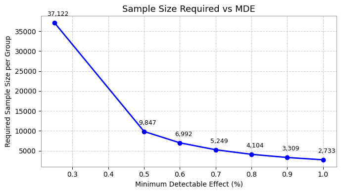
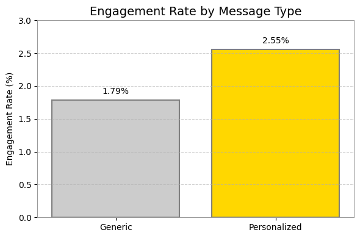
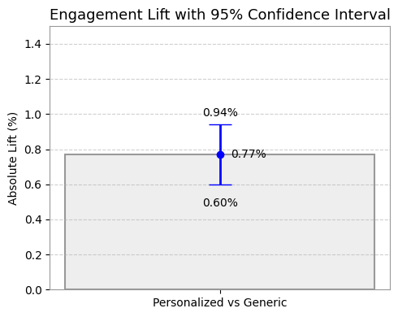

# A/B Test Analysis: Impact of Personalized Messaging

This project analyzes the effectiveness of **personalized vs. generic messages** on user engagement. The workflow includes:

- Data processing with **PySpark** (handling 580,000+ rows efficiently)
- Experiment design with **power analysis**
- Statistical validation via **Z-test & confidence intervals**
- Business interpretation and practical recommendations

It showcases an end-to-end A/B testing pipeline that simulates a real-world marketing experiment.

---

## Objective

To evaluate whether personalized messages lead to higher user engagement than generic messages through A/B testing and statistical validation.

---

## Dataset Overview

The dataset contains user-level interaction logs with the following columns:

- `user_id`: Unique identifier
- `message_type`: 'Personalized' or 'Generic'
- `engaged`: Boolean flag indicating user engagement
- `total_messages_seen`: Total messages seen by the user
- `most_engagement_weekday`, `most_engagement_hour`: Temporal behavior features

---

## Data Processing with PySpark

We used **PySpark** to process and clean the data efficiently at scale:

- Dropped nulls in key columns (`user_id`, `message_type`)
- Removed users assigned to both test groups to preserve test validity
- Handled duplicates by keeping the first occurrence per user and group
- Converted boolean `engaged` to numeric (0/1)
- Aggregated data to calculate engagement rate per group

Notebook: [`01_data_cleaning_pyspark.ipynb`](notebooks/01_data_cleaning_pyspark.ipynb)

---

## Power Analysis (Experimental Design)

Before running the test, we assume that:

- The **baseline engagement rate** is ~1.79% (from Generic group)
- A **+0.5% absolute lift** (to 2.29%) is the **Minimum Detectable Effect (MDE)** we care about
- We aim for **80% power** and **5% significance (alpha)**

Using power calculations (`statsmodels`), we estimated that:
> We would need **~9,848 users per group** to detect a +0.5% lift with statistical confidence.

This defines the smallest effect size we consider **business-relevant**. Any improvement smaller than 0.5% is considered not worth acting upon.

---

## Statistical Analysis with Python

Performed with `pandas` and `statsmodels`:

- **Power Analysis** to calculate required sample size using `statsmodels`
  > Required ~9,848 users per group to detect a +0.5% lift with 80% power


- **Two-proportion Z-test** comparing engagement between groups
  > - p-value < 0.0000017  
  > Statistically significant

- Calculated **Confidence Interval (95%)** for absolute lift
  > - Absolute Lift: +0.77%  
  > - CI Range: [+0.60%, +0.94%]
  

Notebook: [`02_statistical_analysis_python.ipynb`](notebooks/02_statistical_analysis_python.ipynb)

---
## Visualizations

### 1. Sample Size Required by Minimum Detectable Effect


This line chart illustrates how the required sample size changes depending on the MDE selected in experiment design.

### 2. Engagement Rate Comparison


This chart compares user engagement rates between the Generic and Personalized message groups.


### 3. Observed Lift with 95% Confidence Interval


The bar shows the observed absolute lift of 0.77%, with confidence bounds at 0.60% and 0.94%.


---

## Business Insight & Conclusion

- The observed lift of **+0.77%** is both statistically significant **and above our 0.5% MDE**.
- The **95% Confidence Interval [+0.60%, +0.94%]** is **entirely above** the MDE threshold, making the result **business-relevant**.
- Given the sample size (~588,000 users), this translates to approximately **4,500 additional user engagements**.
- The company should **scale up personalized messaging**, as it yields a meaningful return at scale.

> However, if the confidence interval had included or fallen below the MDE (e.g., [+0.2%, +0.5%]), the result might be statistically significant but **not worth implementation**, especially if personalization incurs higher campaign complexity or operational cost.

---

## Repository Structure

```
pyspark-ab-test-engagement-analysis/
├── notebooks/
│   ├── 01_data_cleaning_pyspark.ipynb
│   └── 02_statistical_analysis_python.ipynb
├── images/
│   ├── engagement_bar.png
│   ├── lift_confidence_interval.png
│   └── power_curve.png
└── README.md
```

📁 Dataset (external):  
🔗 [Engagement Dataset (Google Drive)](https://drive.google.com/file/d/1Dgrd8WjGkMHk8IVkioEECeAsPokpC0J8/view?usp=sharing)


